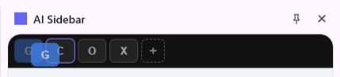
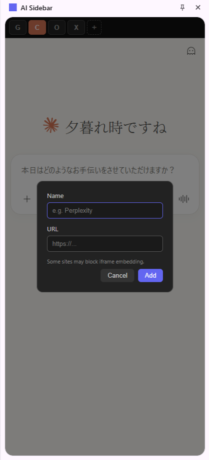

# AI Sidebar

A Chrome extension that gives you quick access to AI chat services from Chrome's native Side Panel. Switch between Claude, Gemini, ChatGPT, and Grok with one click — or add any URL you want.


## Features

- **Chrome Side Panel** — Opens as a native side panel that pushes page content aside (not an overlay)
- **Built-in AI services** — Claude, Gemini, ChatGPT, and Grok pre-configured
- **Drag & drop reorder** — Rearrange service tabs however you like; order is saved

  

- **Add custom URLs** — Click `+` to add any service (Perplexity, Mistral, etc.)

  

- **Keyboard shortcut** — `Alt+A` to toggle the panel (customizable via `chrome://extensions/shortcuts`)
- **Session persistence** — Each service keeps its state when you switch tabs; no reloading

> **Note:** Some services (e.g., Grok) block iframe embedding on their servers. For these, a "Open in new tab" fallback is provided.

## Install

1. Clone or download this repo
2. Open `chrome://extensions/`
3. Enable **Developer mode** (top right)
4. Click **Load unpacked** → select this folder
5. Press `Alt+A` or click the extension icon to open the side panel

## Customize shortcut

1. Go to `chrome://extensions/shortcuts`
2. Find **AI Sidebar** → **Toggle AI Side Panel**
3. Set your preferred key combination

## How it works

- Uses Chrome's [Side Panel API](https://developer.chrome.com/docs/extensions/reference/api/sidePanel) for native integration
- `declarativeNetRequest` removes `X-Frame-Options` and `CSP` headers so AI services can load in iframes
- A `MAIN` world content script overrides frame-busting JavaScript on target domains
- Service order and custom URLs are saved to `chrome.storage.local`

## Files

```
ai-sidebar-extension/
├── manifest.json       # Extension config, permissions, shortcuts
├── background.js       # Side panel behavior setup
├── sidepanel.html/js/css  # Panel UI: tabs, iframes, modal
├── frame-bypass.js     # Frame-busting override (MAIN world)
├── rules.json          # Header removal rules (declarativeNetRequest)
├── options.html/js     # Settings page
└── icons/              # Extension icons
```

## License

MIT
